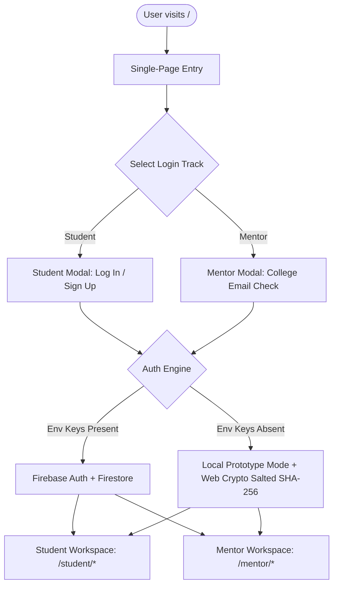

# Project Documentation: It's Your App (Mentorship Platform)

> **"Made by mentors, built for you"**  
> *Honest, institutional guidance from verified seniors at IITs, NITs, and IISERs across Arts, Commerce, Science (PCM), and Science (PCB).*

---

## 📌 Executive Summary & Quick Links

- **Live Deployed Web Application:** [https://itsyour-mentor-connect.vercel.app](https://itsyour-mentor-connect.vercel.app)
- **Official GitHub Repository:** [https://github.com/aparnatiwari144-lgtm/itsyour-mentor-connect-](https://github.com/aparnatiwari144-lgtm/itsyour-mentor-connect-)
- **Local Dev Server URL:** [http://localhost:5173/](http://localhost:5173/)
- **Technology Stack:** React 18, Vite 5, Tailwind CSS, React Router v6, Firebase Authentication & Firestore (with automatic Web Crypto salted SHA-256 local prototype fallback), Lucide Icons, Recharts, Canvas Confetti.

---

## 🎯 Pitch Deck Context & Problem Statement

In the Indian entrance and higher-education ecosystem:
- **Only 23%** of high school students decide their academic and career paths based on genuine self-assessment and subject interest.
- **68%** are heavily influenced by parental and societal pressure, leading to high burnout, mismatched degrees, and career dissatisfaction.
- **Commercial coaching platforms** push sales quotas rather than objective guidance.
- **"It's Your App"** bridges this gap by connecting students directly with verified college seniors who have recently walked the path and can give honest, real-world advice on entrance exams, college life, branch selection, and genuine career trajectories.

---

## 🎨 Visual Identity & Claymorphism UI System

The platform features a proprietary **Soft 3D Claymorphism** design system with a soft blush-pink and lavender aesthetic:

| Design Element | Specification | Rationale |
| :--- | :--- | :--- |
| **Primary Canvas** | Gradient from `#FFFFFF` via `#FFF8F9` to `#FDE8EA` | Calming, warm, and approachable tone for students experiencing exam stress. |
| **Accent Colors** | Rose (`#B3263E`) and Deep Maroon (`#7A1530`) | Premium brand recognition matching pitch deck guidelines. |
| **Secondary Tint** | Soft Lavender (`#E6DDF7`) | Complementary tone adding gentle depth to tiles and cards. |
| **Card Geometry** | Chunky border radius (`28px` to `36px`) | Soft 3D clay look with dual inner highlight and soft outer dropshadow (`shadow-soft`, `shadow-card`). |
| **Typography** | Poppins (Headings & Buttons), Inter (Body & Data) | Clean modern legibility across desktop and mobile screens. |
| **Original Brand Logo** | Bespoke line-art graphic of a senior helping a student climb | Inline SVG with rose-gold gradient stroke, symbolizing empowerment and genuine mentorship. |
| **Pastel Clay Tiles** | 4 Distinct Tints: Pink, Yellow, Baby-Blue, Lavender | Visual hierarchy for key statistics (Sessions, Hours Mentored, Students Helped, Honorarium). |

---

## 🏛️ System Architecture & Technology Stack



### 1. Dual-Mode Authentication Engine
- **Cloud Mode (Firebase Auth + Firestore):** Active when `.env` configuration contains `VITE_FIREBASE_API_KEY`, `VITE_FIREBASE_AUTH_DOMAIN`, and `VITE_FIREBASE_PROJECT_ID`.
- **Local Prototype Mode (Web Crypto API):** Automatically activates when Firebase credentials are not supplied.
  - Never stores plain-text passwords.
  - Generates unique cryptographic salt per user and computes SHA-256 hashes using browser-native `crypto.subtle.digest`.
  - Keys all personal records by unique user ID: `iyapp_sessions_${uid}`, `iyapp_streak_${uid}`, `iyapp_marks_${uid}`, `iyapp_notes_${uid}`, `iyapp_quizzes_${uid}`.
  - Displays visible indicator: *"Prototype mode • Data stays in this browser"*.

### 2. Institutional Mentor Verification Policy
- Mentors **must register with an official college-domain email** (`@nitk.edu.in`, `@iiserkol.ac.in`, `@iitb.ac.in`, `@du.ac.in`, etc.).
- Allow-list and institutional parser configured in `src/config/verifiedDomains.js`.
- If an unverified college email signs up, they receive a *"Verification pending"* banner with limited dashboard scheduling until verified. A 1-click *"Simulate College Verification"* action is provided for prototype demonstration.
- **Zero Ratings / Stars Policy:** Rating stars and numbers have been completely removed throughout the platform in favor of authentic written notes and hours mentored.

---

## 📚 4 Academic Streams

The platform provides complete domain isolation across 4 distinct streams:

1. **Science (PCM)** — Engineering, JEE Main & Advanced, B.Tech branches (CSE, ECE, Civil, Mechanical), NDA, Architecture.
2. **Science (PCB)** — Medicine, NEET, IISER Natural Sciences research, IAT exam, Biotechnology, Pharmacy, Nursing.
3. **Commerce & Management** — CA Foundation/Inter, CUET B.Com (Hons), IPMAT (IIM Indore/Rohtak), Economics, Finance, Marketing.
4. **Arts & Humanities** — CUET Arts, Civil Services/UPSC foundation, Law (CLAT), Psychology, Journalism, International Relations.

---

## 👥 Verified Senior Mentors Directory (13 Total)

### The 5 Real Institutional Mentors (Pre-seeded & Linkable):
1. **Bhanu Kumar Pandey** — IISER Kolkata (`bkp26ms173@iiserkol.ac.in`) • BS-MS Natural Sciences • Science (PCB)
2. **Akash Patel** — NITK Surathkal (`akashpatel.261ec105@nitk.edu.in`) • B.Tech ECE • Science (PCM)
3. **Soham Purohit** — NITK Surathkal (`sohampurohit.261cv146@nitk.edu.in`) • B.Tech Civil • Science (PCM)
4. **K N Vineeth Rao** — NITK Surathkal (`knvineethrao.261cv119@nitk.edu.in`) • B.Tech Civil • Science (PCM)
5. **Mausmi** — NITK Surathkal (`mausmi.261ec135@nitk.edu.in`) • B.Tech ECE • Science (PCM)

### The 8 Curated Demo Mentors (Arts & Commerce):
- **Arts (4 Mentors):** Radhika Sundaram (St. Stephen's College, DU), Aarav Saxena (Hindu College, DU), Devika Menon (Miranda House, DU), Kabir Sen (Ashoka University).
- **Commerce (4 Mentors):** Shreya Agrawal (SRCC, Delhi University), Rohan Malhotra (Shaheed Sukhdev College of Business Studies), Tanya Bansal (Lady Shri Ram College for Women), Ankit Singhal (IIM Rohtak IPM).

---

## 📱 Application Flow & User Journeys

### 1. Single-Page Entry (`/`)
- Unified landing page with no extra redirects.
- Top bar with line-art logo, verification pill, and prototype mode badge.
- Two big 3D clay cards: **"Login as Student"** and **"Login as Mentor"**.
- Interactive clay modal with **Log In** and **Sign Up** tabs:
  - Password visibility toggle (show/hide).
  - "Stay signed in" preference checkbox.
  - "Forgot password?" modal simulation.
  - Quick 1-click **"Try Demo Account (Aparna Tiwari)"** button for instant evaluation.
  - Quick-fill selector for the 5 real mentors.
- 4 Key Guarantee Badges: **13 Verified Mentors**, **Free Trial (1st Session on Us)**, **1:1 Interactive Calls**, **Verified Only (College Emails)**.

### 2. Student Workspace (`/student/*`)
- **Dashboard:** Time-based personal greeting (`Good Morning, <Name>!`), active stream badge, 4 clay stat tiles, weekly study overview bar chart, topic focus donut chart, and upcoming session cards.
- **Find Mentors (`/student/mentors`):** Search by keyword, filter by college domain, branch, and stream. Detailed senior cards with institutional email badge and written feedback.
- **Booking Engine (`/student/book/:id`):** 7-day calendar slot selection, 1:1 or group format, doubt notes input, and free trial automatic discount calculation (₹0 for first booking).
- **Interactive Video Call Room (`/student/call/:id`):** Live webcam simulation with animated audio waves, ticking elapsed timer, screen share presentation mode, hand raise, live in-call chat, and collaborative notes.
- **Daily Quizzes (`/student/quizzes`):** Stream-specific daily subject practice with instant score computation, percentage calculation, and history logs.
- **Marks & Test Tracker (`/student/marks`):** Mock test logging with percentile and rank calculations, subject breakdown, and progress tracking.
- **Study Roadmap Planner (`/student/planner`):** Stream milestones with checklist progress bars and categorized deliverables.
- **Recorded Sessions (`/student/recorded-sessions`):** Searchable archive of completed video sessions with embedded playback modal and key timestamps.
- **Study Notes (`/student/notes`):** Note-taking editor with search, stream categorization, and timestamps.
- **Streak & Habit Tracker (`/student/streak`):** Daily active login counter, calendar activity heat-dots, and streak milestone achievement badges.
- **Plans & Billing (`/student/billing`):** Transparent pricing tiers (*1st Free Trial*, *Starter Pack*, *Pro Roadmap Pack*) with clear discount indicators.

### 3. Senior Mentor Workspace (`/mentor/*`)
- **Dashboard:** Session request queue (Accept / Decline), today's scheduled calls, total hours mentored, students helped, mock honorarium earnings, and verified credentials badge.
- **Availability Manager (`/mentor/availability`):** Weekly slot creator to publish available booking windows for mentees.
- **Session Requests (`/mentor/requests`):** Review incoming mentee bookings with their class, doubts, and trial status.
- **Roster & Private Notes (`/mentor/students`):** Mentee management table with session count, call history, and private advice notes.
- **Feedback Wall (`/mentor/feedback`):** Real mentee written reviews (no star ratings).
- **Verification Audit Trail (`/mentor/verification`):** 3-tier milestone audit demonstrating college domain verification, enrolled status, and academic credibility.

---

## 🛠️ Local Development & Deployment Guide

### Prerequisites
- Node.js (v18.0.0 or higher recommended)
- npm or yarn

### 1. Installation
```bash
# Clone the repository
git clone https://github.com/aparnatiwari144-lgtm/itsyour-mentor-connect-.git
cd itsyour-mentor-connect-

# Install project dependencies
npm install
```

### 2. Environment Configuration (Optional for Firebase Cloud Mode)
Copy `.env.example` to `.env`:
```bash
cp .env.example .env
```
Fill in your Firebase project credentials:
```env
VITE_FIREBASE_API_KEY=your_api_key_here
VITE_FIREBASE_AUTH_DOMAIN=your_project_id.firebaseapp.com
VITE_FIREBASE_PROJECT_ID=your_project_id
VITE_FIREBASE_STORAGE_BUCKET=your_project_id.appspot.com
VITE_FIREBASE_MESSAGING_SENDER_ID=your_messaging_sender_id
VITE_FIREBASE_APP_ID=your_app_id
```
*(If left blank or omitted, the application runs in Local Prototype Mode with full features and salted SHA-256 Web Crypto security.)*

### 3. Running Locally
```bash
npm run dev
```
Open **`http://localhost:5173/`** in your browser.

### 4. Production Build & Verification
```bash
npm run build
```
Generates optimized static production bundle in `dist/`.

---

## 🔒 Security & Privacy Commitments

1. **Zero Phone Numbers:** Phone numbers are strictly never displayed or shared in the platform to preserve student and mentor privacy.
2. **Institutional Validation:** Every mentor profile is tied to an authentic institutional domain name (`.edu.in` / `.ac.in`).
3. **No Plain-Text Storage:** Even in local offline mode, user passwords undergo salted SHA-256 derivation via the native Web Crypto API.
4. **Data Isolation:** Every student account maintains its own isolated streak, notes, marks, and session history.

---

## 📄 License

Developed for **It's Your App Mentorship Initiative**.  
All rights reserved © 2026.
